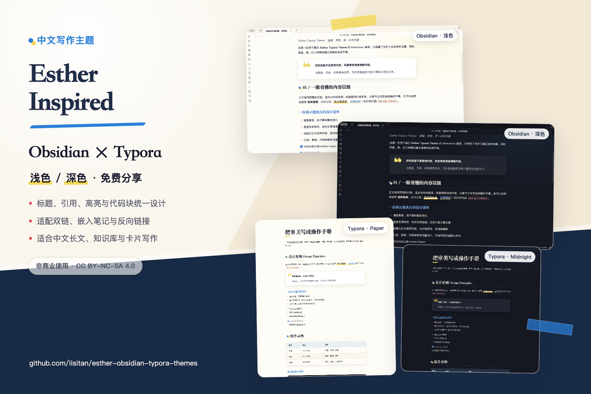
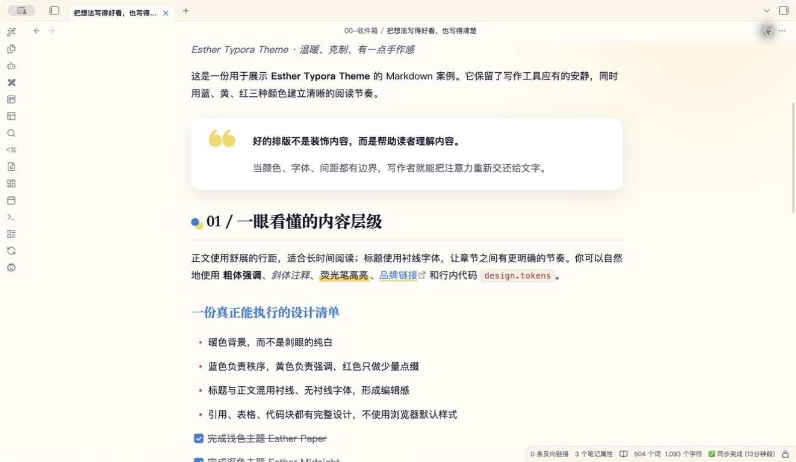
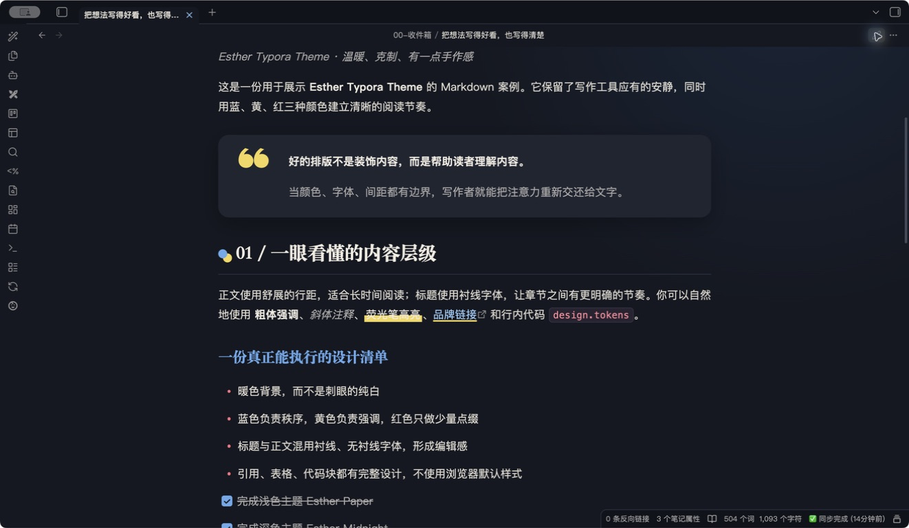
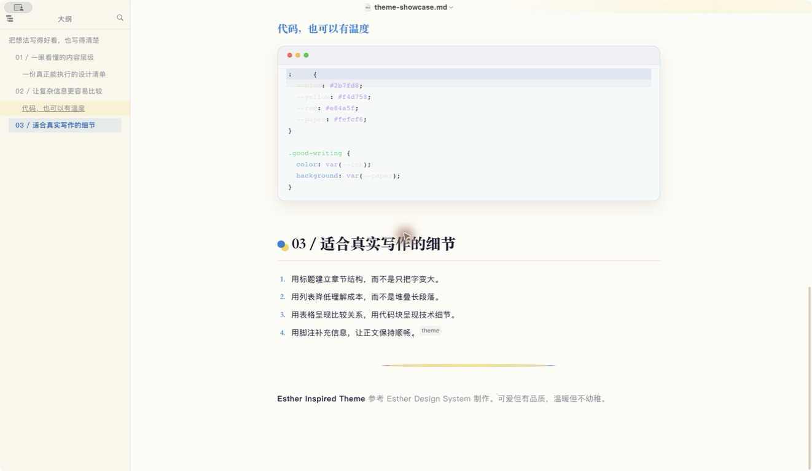
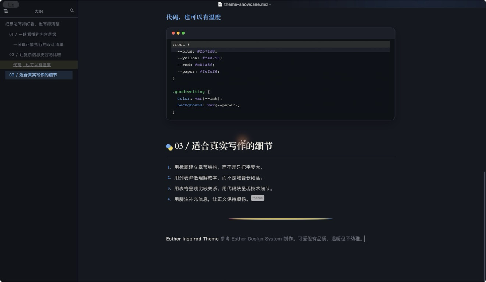

# Esther Inspired：Obsidian 与 Typora 主题

> 本项目是基于 [Esther Design System](https://github.com/esthersjw/esther-design-system) 视觉语言制作的非官方、非商业改编主题。原设计系统作者为 **ESTHER不二（esthersjw）**。本项目与原作者没有隶属关系，也不代表原作者的官方发布或认可。

这是一套同时适用于 **Obsidian** 和 **Typora** 的中文写作主题。整体保持温暖、克制、带一点手作感：蓝色负责结构，黄色负责强调，红色只做少量点缀。



仓库包含一套可自动切换明暗模式的 Obsidian 主题，以及两套 Typora 主题：

- **Obsidian — Esther Inspired**：跟随 Obsidian 的浅色与深色模式自动切换完整配色。
- **Typora — Esther Inspired Paper**：温暖、柔和的纸张感浅色主题。
- **Typora — Esther Inspired Midnight**：以深海军蓝为底色的深色主题。

## 效果预览

### Obsidian · 浅色模式



### Obsidian · 深色模式



### Typora · Paper 浅色主题



### Typora · Midnight 深色主题



## 主题特点

- 阅读模式与实时预览使用一致的排版和视觉语言。
- 标题使用具有编辑感的衬线字体，正文使用安静清晰的无衬线字体。
- 引用、表格、代码块、任务列表和脚注均经过完整设计。
- 荧光高亮只覆盖文字下半部分，更接近真实记号笔划过的效果。
- 支持 Obsidian 双链、失效链接、别名、嵌入笔记、反向链接和出链。
- 覆盖 Obsidian 工作区、笔记属性、搜索、关系图谱、Canvas 和打印样式。
- 覆盖 Typora 源代码模式、侧边栏和应用界面样式。
- 主题不加载远程字体或图片，不会发起网络请求。

## 在 Obsidian 中安装

### 从社区主题目录安装

1. 打开 **设置 → 外观 → 主题 → 管理**。
2. 搜索 **Esther Inspired**。
3. 选择 **安装并使用**。

### 从 GitHub Release 安装

1. 从[最新版本](https://github.com/lisitan/esther-obsidian-typora-themes/releases/latest)下载 `manifest.json` 和 `theme.css`。
2. 在知识库中创建以下文件夹：

```text
<你的知识库>/.obsidian/themes/Esther Inspired/
```

3. 将 `manifest.json` 和 `theme.css` 放入该文件夹。
4. 打开 **设置 → 外观 → 主题**，选择 **Esther Inspired**。

主题已发布到 [Obsidian 社区主题目录](https://community.obsidian.md/themes/esther-inspired)。

### 自定义

- 主题会跟随 Obsidian 的浅色或深色模式自动切换。
- 可以直接使用 Obsidian 的字体与界面缩放设置。
- 安装可选的 **Style Settings** 社区插件后，可以调整正文阅读宽度、开启紧凑界面模式，并选择让文件列表顶部按钮仅在悬停时显示。

## 在 Typora 中安装

1. 从[最新版本](https://github.com/lisitan/esther-obsidian-typora-themes/releases/latest)下载 `esther-inspired-typora-1.1.14.zip`。
2. 解压后，将以下文件和文件夹放入 Typora 主题文件夹：

```text
esther-inspired-paper.css
esther-inspired-midnight.css
esther/
```

3. 重新启动 Typora。
4. 在主题菜单中选择 **Esther Inspired Paper** 或 **Esther Inspired Midnight**。

macOS 中常见的 Typora 主题文件夹位置为：

```text
~/Library/Application Support/abnerworks.Typora/themes/
```

本主题已在 macOS 上完成设计和实际效果测试。Windows 与 Linux 会使用系统备用字体，应用界面的细节可能略有不同。

## 仓库结构

```text
theme.css                 Obsidian 主题样式
manifest.json             Obsidian 主题信息
screenshot.png            512 × 288 的 Obsidian 商店展示图
typora/                    Typora 浅色、深色主题及共用样式
assets/                    两个平台的完整浅色、深色截图
examples/                  Markdown 主题展示案例
submission/                两个平台的官方目录投稿材料
```

## 署名与许可证

本项目改编自 **ESTHER不二（esthersjw）**创作的 [Esther Design System](https://github.com/esthersjw/esther-design-system)。原项目和本改编主题均采用 [CC BY-NC-SA 4.0](https://creativecommons.org/licenses/by-nc-sa/4.0/) 许可证发布。

使用和分享本主题时必须遵守以下条件：

- 必须署名原作者 ESTHER不二（esthersjw）。
- 必须提供原项目与许可证链接，并说明主题经过改编。
- 不得用于商业目的。
- 修改或继续改编后，必须使用相同许可证发布。
- 不得暗示原作者对本项目进行了认可、赞助或官方发布。

完整说明请查看 [LICENSE](LICENSE) 和[第三方来源声明](THIRD_PARTY_NOTICES.md)。

## English overview

Esther Inspired is an unofficial, non-commercial theme for Chinese long-form writing in Obsidian and Typora. It combines warm paper and midnight palettes with a clear editorial hierarchy, quotation cards, half-height marker highlights, wiki links, backlinks, tables, tasks, and code styling. It does not load remote assets or collect telemetry.

### Install in Obsidian

Open **Settings → Appearance → Themes → Manage**, search for **Esther Inspired**, and select **Install and use**. The theme supports both light and dark modes.

For optional customization, install the **Style Settings** community plugin to change the reading width or enable the compact interface. Standard Obsidian font and interface scaling settings are also supported.

### License and attribution

This is an unofficial adaptation inspired by [Esther Design System](https://github.com/esthersjw/esther-design-system) by **ESTHER不二 (esthersjw)**. It is not affiliated with or endorsed by the original creator. The theme is distributed under [CC BY-NC-SA 4.0](LICENSE): attribution is required, commercial use is prohibited, and adaptations must use the same license.
